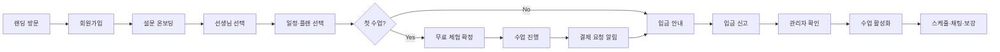
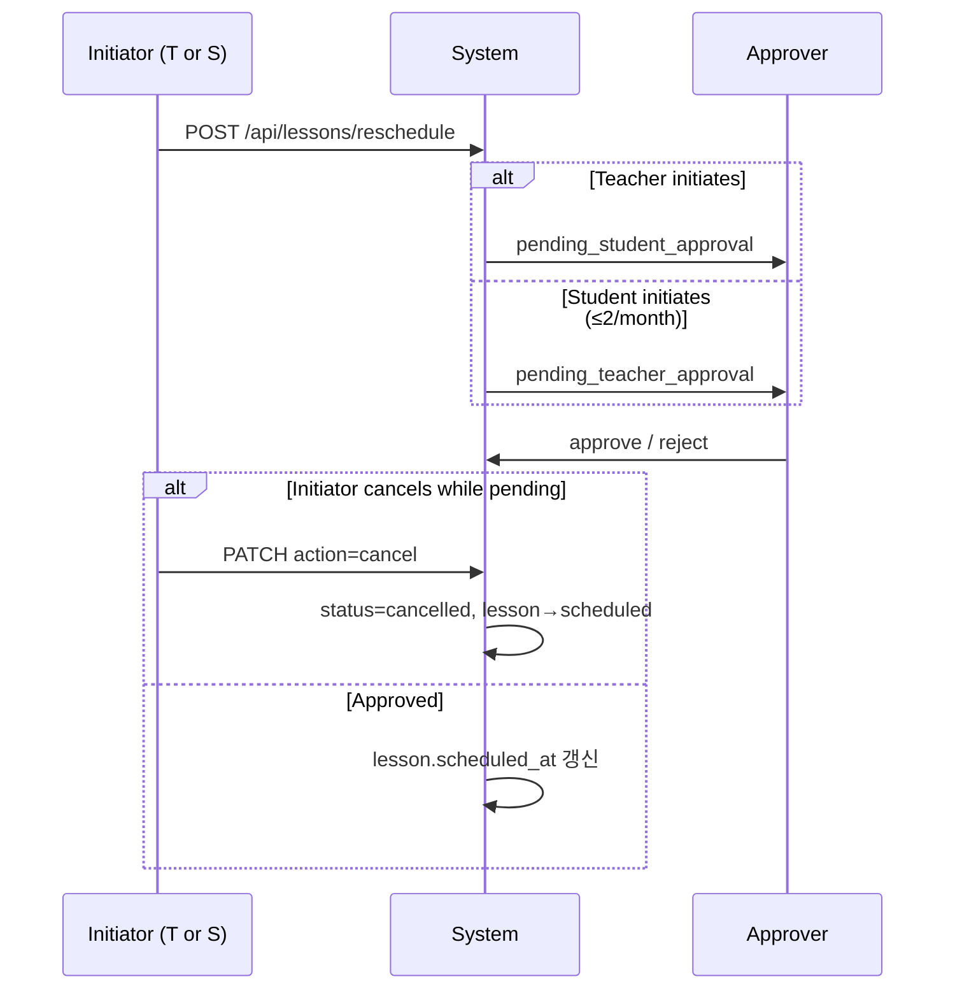
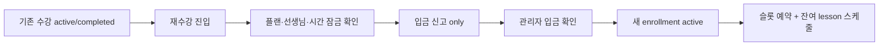

# Pass on English — 전체 프로젝트 가이드

## 1. 프로젝트 소개

### 1.1 서비스 개요

**Pass on English**는 필리핀 원어민 영어 선생님을 고용하여 한국·중국 학생에게 **Zoom 화상 수업**을 제공하는 온라인 영어 교육 플랫폼이다.

- 화상 프로그램(Zoom)은 **플랫폼과 API 연동하지 않음** — 수업은 Zoom 등 외부 도구로 진행, 일정·결제·커뮤니케이션만 플랫폼에서 관리
- **네이티브 앱 없음** — PWA + Web Push로 홈 화면 추가 및 알림 제공
- **결제** — PG 없이 **계좌이체**만 (관리자 입금 확인 후 수업 승인)

### 1.2 요금제

모든 수업 **20분**, **20분 단위 타임슬롯** (:00·:20·:40). 휴식은 선생님이 Availability에서 슬롯 Off. 관리자 `/admin/pricing` 에서 요금·회차·`session_minutes` 수정 가능.

| 플랜 | 한국 | 중국 | 회차 |
|------|------|------|------|
| 주5회(월~금) 20분 | 87,000원 | 480위안 | 20 |
| 월·수·금 20분 | 90,000원 | 490위안 | 12 |
| 화·목 20분 | 64,000원 | 340위안 | 8 |
| 주말(토·일) 20분 | 64,000원 | 340위안 | 8 |

### 1.3 사용자 역할 및 진입점

| 역할 | 진입 URL | UI | 랜딩 노출 |
|------|----------|-----|-----------|
| **학생 계정** | `/ko`, `/zh-CN` → login | ko/zh-CN | ✅ |
| **선생님** | `/teacher/login` | en | ❌ |
| **관리자** | `/admin/login` | ko | ❌ |

| 역할 | 주요 기능 |
|------|-----------|
| **학생 계정** (account_holder) | 로그인, 자녀 등록·전환, 입금 신고(입금자=계정명) |
| **수강생** (learner) | My Lessons, Learning Results, 채팅, trial·보강(learner별) |
| **선생님** | My Lessons, Availability, Schedule, Growth Reports, Salary, 채팅 |
| **관리자** | 학생/선생님 현황, **운영 센터**, **검토 센터**, 프로필·요금·급여·FAQ |

---

## 2. 기술 스택

| 영역 | 기술 |
|------|------|
| Frontend | Next.js (App Router), TypeScript |
| UI | Tailwind CSS, Shadcn UI |
| i18n | next-intl |
| PWA / Push | Web Push API, `public/sw.js` (수동 SW) |
| Backend | Next.js Route Handlers, Supabase |
| Database | Supabase PostgreSQL |
| Auth | Supabase Auth |
| Realtime | Supabase Realtime (채팅) |
| Storage | Supabase Storage |
| Infra | **Tencent Cloud 홍콩 리전** |

### 2.1 중국 접속 제약

다음을 **사용하지 않는다**:

- Google 서비스 (Fonts, Analytics blocked 대체)
- Firebase 등 중국 차단 서비스
- 중국에서 접속 불가한 CDN·API

**필수**:

- 홍콩 리전 배포로 한·중 양국 접속
- Self-host fonts/assets
- Supabase/API latency HK 기준 검증

### 2.2 MVP 구현 현황 (2026-08-17)

| 기능 | 상태 | 구현 위치 |
|------|------|-----------|
| My Lessons (teacher/student) | ✅ | `TeacherMyLessonsHub`, `MyLessonsHub` |
| **20분 타임슬롯** | ✅ | `SLOT_BLOCK_MINUTES=20`, `:00/:20/:40` |
| **재수강(renewal)** | ✅ | `createRenewalEnrollment`, `EnrollmentFlow` renew 모드 |
| **관리자 수업 운영 센터** | ✅ | `/admin/operations`, 조치 로그·undo |
| **관리자 검토 센터** | ✅ | `/admin/reschedule`, 4탭 + 처리 로그 |
| 수업 상세·교재/Special Notes·과거 교재 | ✅ | `TeacherLessonDetailCard`, DB 교재 이력 trigger |
| Schedule 캘린더·노쇼 회색 셀 | ✅ | `TeacherWeeklyScheduleCalendar` |
| 보강 (양방향·취소·월 2회) | ✅ | migration 029 원자 RPC + 20분 그리드 스냅 |
| 학생·선생님 채팅 | ✅ | 선생님/학생/관리자 대상 선택, shared chat UI |
| 선생님 신규 수업 배정 알림 | ✅ | 수강목적·수업 모달·확인 처리, 무료체험 NEW 배지 |
| Lesson Feedback + 교재·progressPages 스냅샷 | ✅ | `/api/learning/feedback`, 학생 상세 수업 로그 |
| Monthly Growth Report (5필드) | ✅ | `MonthlyGrowthReportEditor` |
| Teacher Salary (월별 명세·EN 보너스 정책) | ✅ | `TeacherSalaryDashboard` |
| Admin: teacher-profiles, pricing, FAQ | ✅ | `/admin/teacher-profiles`, `/admin/pricing`, `/admin/faq` |
| **Supabase DDL** | ✅ | 운영 migration `001`~`035` (`024` 제외) — [`db.md`](./db.md) §8 |
| **`pricing_plans` → Supabase** | ✅ | `pricing-plans/repository.ts`, `/api/pricing-plans` |
| **도메인 데이터 → Supabase** | ✅ | repository write + 제한된 bootstrap/cache read — [`backend.md`](./backend.md) §1.2 |
| **Auth · RLS** | ✅ **2차 완료** | middleware 다역할 + session UUID + learner access 검증 |
| **관리자 메시지 · CS · 단체 발송** | ✅ | `/api/admin/messages/*`, broadcast → 1:1 CS 채팅 통합 |
| 입금 확인·재무 API | ✅ | 입금 확인 → `finance_transactions`; `/api/admin/finance/transactions` |
| Trial → 결제 → 승인 | ✅ | learner 단위 enrollment |
| Account vs Learner | ✅ | `accounts/repository` + `account-store-sync`, StudentSwitcher |
| Teacher signup E2E (Auth → profile → admin approve) | ✅ | packages A–D; `test-api-e2e` teacher signup block |
| Teacher signup API | ✅ | `/api/teacher/applications`, `/api/teachers/profile` → Supabase |
| 학생·선생님 내 정보 관리 | ✅ | `/student/settings`, `/teacher/profile`, password 분리 |
| ZOOM/VOOV 선호·매칭 | ✅ | 가입/설정 복수 선택 + 수강 확정 서버 재검증 |
| 학생 성별·가입 메모 | ✅ | 관리자/교사 학생 카드와 가입 검토/상세 연계 |
| API 권한 기본 거부·DTO 제한 | ✅ | middleware allowlist, route ownership, profile/단가 열 보안 |
| 급여 정산·재무 원자화 | ✅ | migration 027~029; 신규/live 분기 보너스 방지 035 |
| 랜딩·SEO·정책 페이지 | ✅ | DB 요금제 전체 노출, locale metadata, about/privacy/terms/refund |

### 2.3 보안·배포 잔여 (2026-08-17)

| 항목 | 상태 |
|------|------|
| 선생님 세션 바인딩 (`TeacherSessionProvider`) | ✅ |
| 학생 logout (`StudentAppShell`) | ✅ |
| 학생 login → `/api/auth/login` + role 검증 | ✅ |
| 학생 API middleware (`/api/student/*`, enrollments, learning, chat) | ✅ |
| pricing admin mutation middleware (GET만 public) | ✅ |
| 미분류 API 기본 거부 | ✅ |
| profile private/teacher compensation 열 제한 | ✅ |
| 보강·급여 정산 트랜잭션 경계 | ✅ |
| 자동 시스템 알림 cron | ⏳ |
| PWA install 안내 배너 | ✅ (실제 설치 가능 여부는 브라우저 정책에 따름) |
| HK 배포 | ⏳ |

**테스트 묶음**: `test:auth*`, `test:rls`, `test:transactions`, `test:api:e2e`, 설정·채팅·boundary 회귀 테스트. 실행 명령은 `package.json`을 SSOT로 한다.

---

## 3. 문서 구조

| 문서 | 내용 |
|------|------|
| [front.md](./front.md) | UI/UX, 라우팅, 컴포넌트, PWA, i18n |
| [backend.md](./backend.md) | API, 비즈니스 로직, Push, 배포 |
| [db.md](./db.md) | 스키마, RLS, 트리거, 급여 계산 |
| [guide.md](./guide.md) | 본 문서 — 전체 흐름·온보딩·운영 |

원본 요구사항: [원어민 화상영어 플랫폼 서비스 앱 개발 요구사항 정리.md](./원어민%20화상영어%20플랫폼%20서비스%20앱%20개발%20요구사항%20정리.md)

---

## 4. 핵심 사용자 플로우

### 4.1 학생 여정



### 4.2 보강(일정 변경)



- **학생**: 월 2회 (`cancelled` 제외), **선생님**: 제한 없음
- 학생·선생님·관리자 포털 모두 `RescheduleProgressPanel` 로 진행 상태 표시

### 4.3 선생님 급여

```
월 명세서 = baseSalary (totalHours × hourlyRate)
         + perfectAttendanceBonus (직전 1개월 만근 완료 후 다음 달부터 25 PHP/h × hours)
         + quarterlyBonus (분기 tier)
         + otherIncentives - deductions

상태: estimated (당월 live) → processing → paid
관리자: live estimate 확정 → processing, 지급 후 paid
```

### 4.4 재수강(renewal)



- 신규 4단계 enrollment UI를 거치지 않음
- API: `POST /api/enrollments` `{ renewFromEnrollmentId, depositorName, amountKrw }`

### 4.5 관리자 수업 운영

```mermaid
flowchart TB
    A[/admin/operations] --> B[선생님 선택]
    B --> C[주간 캘린더]
    C --> D[수업 클릭 → 조치 모달]
    D --> E{조치 유형}
    E --> F[대체 / 노쇼 / 무급취소 / 일정변경]
    F --> G[조치 로그 기록]
    G --> H[주간 로그 패널]
    H --> I{undo?}
    I -->|노쇼·무급취소| J[POST operation-logs/undo]
```

- 캘린더 **이전/다음 주** ↔ 로그 필터 **동기화** (수업 예정 주 기준)
- 노쇼: 원 수업 회색 · 보강 생성 · 학생 +1회 · 선생님 급여 패널티

### 4.6 선생님 신규 가입 (E2E)

```mermaid
flowchart LR
    A[/teacher/signup Step1] --> B[signUp + application]
    B --> C[/teacher/signup/profile]
    C --> D[teachers row pending]
    D --> E[/teacher/login]
    E --> F{status active?}
    F -->|No| G[teacher_not_active]
    F -->|Admin approve| H[검토 센터 teacher_signup]
    H --> I[teachers.status=active]
    I --> J[로그인 · Availability · 학생 매칭]
```

| 단계 | URL / API | 결과 |
|------|-----------|------|
| 1. 지원서 | `POST /api/teacher/applications` (+ password) | `auth.users` + `teacher_applications` |
| 2. 프로필 | `POST /api/teachers/profile` (teacher 세션) | `teachers.id = auth.uid()`, `status=pending` |
| 3. 승인 전 로그인 | `POST /api/auth/login` | `403 teacher_not_active` |
| 4. 관리자 승인 | `/admin/reschedule` → `teacher_signup` approve | `teachers.status=active` |
| 5. 승인 후 | `/teacher/login`, Availability 설정 | 공개 선생님 목록·수강 신청 가능 |

> **관리자**는 demo 시드 계정만 (`demo-admin@example.org`). 관리자 셀프 가입 UI 없음.

---

## 5. 다국어 전략

| 페이지 | 언어 | 자동 선택 |
|--------|------|-----------|
| 랜딩·학생 | **ko, zh-CN** | 접속 국가 (zh→zh-CN, 그 외 ko) |
| 선생님 | en (고정) | — |
| 관리자 | ko (고정) | — |

- **영문(`en`) 랜딩 미제공** — `messages/ko.json`, `messages/zh-CN.json`만 사용
- 선생님·관리자 UI는 locale 세그먼트 없이 고정 언어
- 통화·요금: `country` 필드와 `pricing_plans` 연동

---

## 6. 로컬 개발 환경 설정

### 6.1 사전 요구

- Node.js 20+
- pnpm (권장) 또는 npm
- Supabase CLI
- Docker (Supabase local)

### 6.2 초기 설정

```bash
# 1. 저장소 클론
git clone <repo-url>
cd Pass_on_English

# 2. 의존성
pnpm install

# 3. Supabase 로컬
supabase init
supabase start

# 4. 환경 변수
cp .env.example .env.local
# NEXT_PUBLIC_SUPABASE_URL, ANON_KEY, VAPID keys 등 입력

# 5. DB 마이그레이션 (운영 migration 001 → 035 순서, 024 제외)
supabase db push
# 프로젝트 스크립트로 보안/RLS migration 적용 시: npm run apply:rls
# E2E 데이터는 migration이 아니라: npm run seed:e2e

# 6. 개발 서버
pnpm dev
```

> **DB 연동 검증**: `.env.local`에 Supabase URL·ANON_KEY 설정 후 API Route 호출 시 `ensureSchedulesBootstrapped()`가 cache warm. 랜딩·수강신청은 `/admin/pricing`, FAQ, 선생님 목록에서 확인.

### 6.3 VAPID 키 생성

```bash
npx web-push generate-vapid-keys
```

Public → `NEXT_PUBLIC_VAPID_PUBLIC_KEY`  
Private → `VAPID_PRIVATE_KEY` (서버 only)

---

## 7. 프로젝트 디렉터리 (목표 구조)

```
Pass_on_English/
├── docs/
│   ├── front.md
│   ├── backend.md
│   ├── db.md
│   ├── guide.md
│   └── 원어민 화상영어 ... 요구사항 정리.md
├── supabase/
│   ├── migrations/
│   │   ├── 001_initial_schema.sql
│   │   ├── 002_pricing_plans_plan_type_text.sql
│   │   ├── 003_faq_dashboard_teacher_applications.sql
│   │   ├── ...
│   │   └── 035_fix_ineligible_live_quarterly_bonus.sql
│   └── seeds/e2e_rich_seed.sql # 운영 migration과 분리된 테스트 시드
├── public/
│   ├── icons/          # PWA
│   └── manifest.json
├── src/
│   ├── app/
│   ├── components/
│   ├── lib/
│   ├── hooks/
│   ├── types/
│   └── messages/
├── .env.example
├── next.config.ts
├── tailwind.config.ts
└── package.json
```

---

## 8. 개발 단계 (로드맵)

### Phase 0 — 기반 (1~2주)

- [x] Next.js + Tailwind + Shadcn 보일러플레이트
- [x] Supabase 프로젝트, Auth, profiles + 역할 세션
- [x] next-intl, locale routing (ko, zh-CN)
- [x] PWA manifest + service worker

### Phase 1 — MVP Core (3~4주)

- [x] 랜딩페이지 (ko/zh-CN, 요금표)
- [x] 학생: 가입, 설문, My Lessons, Learning Results
- [x] 선생님: My Lessons, availability, schedule, feedback
- [x] 관리자: teacher-profiles, pricing, students/teachers UI
- [x] DB migrations DDL (`001`~`035`, 024 제외) — [`db.md`](./db.md) §8
- [x] `pricing_plans` Supabase CRUD (첫 도메인 이전)
- [x] 도메인 데이터 → Supabase (chat·finance 포함) — [`backend.md`](./backend.md) §9

### Phase 2 — 운영 기능 (2~3주)

- [x] 보강 요청/승인/취소 플로우 (양방향)
- [x] **관리자 검토 센터** (4탭 + 로그)
- [x] **관리자 수업 운영 센터** (조치·로그·undo·일괄 이관)
- [x] **20분 타임슬롯** 정책 전환
- [x] **재수강** 플로우
- [x] 수업 완료 + 피드백 (progressPages)
- [x] 채팅 (rooms API, StudentChatLink)
- [x] Web Push 구독·발송 API
- [x] 학생·선생님 내 정보 관리와 비밀번호 변경
- [x] ZOOM/VOOV 선호 선택·호환 교사 매칭
- [x] 학생 성별·가입 메모·교재 변경 이력·수업 로그 스냅샷
- [x] 관리자 수업 변경 모니터링/예외 조치 분리

### Phase 3 — 재무·급여 (2주)

- [x] 급여 월별 명세서 (estimated/processing/paid)
- [x] 만근·분기 보너스 정책 UI
- [x] 신규·미종료 월 quarterly bonus 부적격 처리
- [x] 급여 정산 상태·재무 원장 원자 처리
- [ ] 재무 대시보드·차트 (DB 연동 ✅, 고급 차트·cron 스냅샷 ⏳)
- [ ] 월말 정산 스냅샷 (DB cron)

### Phase 4 — 배포·QA

- [ ] Tencent Cloud HK 배포
- [ ] 한·중 접속 테스트
- [ ] PWA iOS/Android 검증 (실제 install prompt)
- [x] Auth·RLS 1·2차 (세션 UUID, 학생 API, pricing mutation 보호)
- [x] API default deny·프로필/교사 단가 열 제한·RLS 감사 1차
- [x] 보강·급여 정산 트랜잭션 경계
- [ ] 운영 배포 전 service role 사용 경로와 Supabase 적용 migration 최종 감사

---

## 9. 배포 (Tencent Cloud HK)

### 9.1 권장 구성

| 구성요소 | 옵션 |
|----------|------|
| Next.js | Docker on CVM 또는 TKE |
| CDN | Tencent Cloud CDN (정적 자산) |
| SSL | Tencent SSL / Let's Encrypt |
| DNS | DNSPod — dual region resolve |
| DB | Supabase Cloud (가까운 리전) 또는 self-host PostgreSQL on HK CVM |

### 9.2 체크리스트

- [ ] HTTPS everywhere
- [ ] `next.config` — `images.domains` Supabase storage
- [ ] Service Worker scope `/`
- [ ] Push: production VAPID on HK domain
- [ ] 중국에서 Google CDN 미사용 확인
- [ ] Real User Monitoring (선택, Tencent APM)

---

## 10. 운영 가이드

### 10.1 일일 업무 (관리자)

1. **검토 센터** (`/admin/reschedule`) — 보강·가입·입금 pending 처리
2. **수업 운영 센터** (`/admin/operations`) — 노쇼·무급취소·대체·일괄 이관
3. 입금 신고 확인 → 학생 enrollment 승인 (검토 센터 또는 학생 상세)
4. 신규 선생님 프로필 등록·수정 (`/admin/teacher-profiles`)
5. **강사 급여** 상태 확인 (`/admin/teacher-salary`)
6. 채팅/문의 대응

### 10.2 월말

1. 선생님 급여: live estimate → **processing** 확정 → 지급 후 **paid**
2. 만근·분기 보너스 검토 (`teacher_salary_statements`)
3. `finance_snapshots` 생성 (추후 automation)
4. 학생 보강 카운트: `request_month` 기준, `cancelled` 제외 (cron)

### 10.3 계좌 정보

- 한국 학생: `.env` `BANK_ACCOUNT_KR`
- 중국 학생: `.env` `BANK_ACCOUNT_CN`
- UI [front.md §5.2.4](./front.md) PaymentInfoPanel

---

## 11. 보안·개인정보

- Supabase RLS 전 테이블 적용
- Service Role Key 서버 전용
- 학생·선생님 PII 최소 수집 (설문, 연락처)
- 채팅 로그 보존 정책 수립 (권장 1년)
- 관리자 계정 MFA 권장

---

## 12. 테스트 전략

| 영역 | 방법 |
|------|------|
| RLS | `npm run test:rls` — JWT 직접 검증 (17케이스, migration 022 applicant read 포함) |
| API E2E | `npm run test:api:e2e` — demo 시드 + Bearer auth (37케이스, **teacher signup A→C** 포함) |
| i18n | locale snapshot |
| PWA | Lighthouse PWA audit |
| Cross-region | VPN KR/CN manual QA |

### 12.1 통합 QA 체크리스트 (teacher signup E2E)

**사전:** `.env.local` (Supabase + `SUPABASE_SERVICE_ROLE_KEY`), migration `001`~`024`, `npm run seed:e2e`, `npm run seed:demo`, `npm run dev`

| # | 역할 | 확인 |
|---|------|------|
| 1 | 선생님 | `/teacher/signup` → 지원서 + password → profile → complete |
| 2 | 선생님 | 승인 전 `/teacher/login` → `teacher_not_active` |
| 3 | 관리자 | `/admin/reschedule` → 신규 선생님 → **프로필 완료** → 승인 |
| 4 | 선생님 | 승인 후 login → Availability 설정 |
| 5 | 학생 | 신규/demo 학생 → enrollment → 승인된 선생님 선택 |
| 6 | 자동 | `npm run test:rls` · `npm run test:api:e2e` green |

---

## 13. 연락·의사결정

| 항목 | 담당 |
|------|------|
| 요구사항 변경 | Product Owner |
| DB 스키마 변경 | db.md 업데이트 후 migration |
| API 변경 | backend.md + OpenAPI (선택) |
| UI 변경 | front.md |

---

## 14. 용어집

| 용어 | 설명 |
|------|------|
| Trial | 학생당 최초 1회 무료 수업 |
| Enrollment | 학생-선생님-플랜 수강 계약 단위 |
| Lesson | 개별 수업 일정 |
| Reschedule / 보강 | 수업 일시 변경 (양방향 승인, initiator 취소 가능, 20분 그리드) |
| Renewal / 재수강 | 기존 plan·teacher·time 유지, 결제만 반복 |
| Operations Center | 관리자 주간 스케줄 + 수업 조치 + 로그·undo |
| Review Center | 관리자 4종 pending 큐 + 처리 로그 |
| Time slot | 20분 그리드 (:00/:20/:40); 휴식=availability Off |
| My Lessons | 선생님/학생 홈 — 다음 수업·오늘 일정·Action Required |
| Growth Report | 월말 5필드 성장 레포트 (lessonsCovered 등) |
| Salary Statement | 월별 급여 명세서 (estimated/processing/paid) |
| Perfect attendance / 만근 | 직전 한 달 전체 근무·수업 실적·결근/무단 변경 없음. 다음 달부터 적용되며 당월 노쇼 시 상실 |
| PWA | Progressive Web App — 홈 화면 설치형 웹 |

---

## 15. 다음 단계

1. ~~본 명세서 리뷰 및 MVP UI 플로우 검증~~ ✅
2. ~~통합 DDL migration + MVP store Supabase 연동 (chat·finance 포함)~~ ✅
3. ~~Auth·RLS 2차 (선생님 UUID, 학생 logout, API 보호)~~ ✅
4. ~~Realtime 채팅 (messages)~~ ✅
5. ~~관리자 메시지 · CS · 단체 발송~~ ✅
6. Tencent Cloud HK 배포 + 한·중 QA
7. 자동 시스템 알림 발송 엔진 (cron, `system_notification_rules` dispatch)
8. demo 시드 → 운영 시드 분리 (`SUPABASE_SERVICE_ROLE_KEY` 필수)

상세 구현은 각 명세서를 참조한다.
